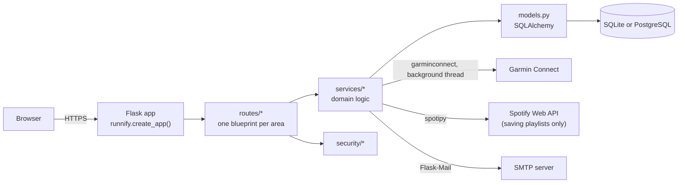
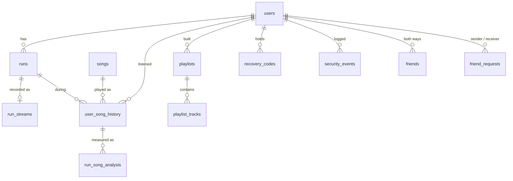

# Architecture

Runnify is one server-rendered Flask application. There is no separate
frontend build: pages are Jinja templates, styles are plain CSS, and a few
small JavaScript modules add behaviour on top of pages that already work
without them. Every asset, font and script is served by the app itself.

## Components

| Layer | Location | Responsibility |
|---|---|---|
| App factory | `runnify/__init__.py` | `create_app()` loads a config profile, validates production settings, binds the extensions, registers blueprints, filters, CLI commands and the error pages |
| Config | `runnify/config.py` | Settings profiles (`development`, `production`, `test`) read from environment variables |
| Extensions | `runnify/extensions.py` | Shared `db`, `migrate`, `csrf`, `limiter`, `mail` and `login_manager`; SQLite connections are tuned here (WAL, busy timeout, foreign keys) |
| Models | `runnify/models.py` | Every table, the user loader and the session-token check |
| Security | `runnify/security/` | Password hashing and policy, lockout, reset tokens, encryption at rest, two-step verification, security headers, rate-limit keys, safe redirects, the audit log |
| Domain logic | `runnify/services/` | Garmin sync, FIT parsing, run streams, history import, scoring, analysis, insights, results, dashboard, playlists, charts, account export and deletion. No request handling |
| Routes | `runnify/routes/` | Request handling and rendering, one blueprint per area |
| Content | `runnify/content/` | The landing page's sample results, computed by the real engine from simulated runs |
| Templates | `runnify/templates/` | `layouts/` (base, public, app, auth, settings), `macros/` (fields, results tables, charts), then one folder per area |
| Static | `runnify/static/` | `css/ui/` (the design system), `css/pages/`, `js/`, the Geist font, icons and vendored GSAP |

## Data model

| Table | Holds |
|---|---|
| `users` | Name, email, Argon2id password hash, encrypted Garmin and Spotify tokens, sync and import status, consent timestamps and policy version, lockout counters, the session token, the encrypted two-step secret |
| `runs` | One Garmin run: start (UTC) and the runner's UTC offset at the time, distance in metres, duration in seconds, average heart rate and pace |
| `run_streams` | The run's samples (offsets, pace to 0.1 s/km, heart rate), zlib-compressed JSON; about 15 KB for an hour |
| `songs` | Spotify track id, name, artist and a learned track length |
| `user_song_history` | A play that overlapped a run: when it started, seconds played, whether it was skipped |
| `run_song_analysis` | A play's measured effect: `pace_delta` (s/km), `hr_delta`, seconds measured, position in the run, method version |
| `playlists`, `playlist_tracks` | Saved playlists, each track with the lift and plays it was chosen on |
| `recovery_codes` | SHA-256 hashes of unused two-step recovery codes |
| `security_events` | Sign-ins and account changes with a truncated IP prefix and a short user agent; kept 90 days |
| `friends`, `friend_requests` | Friendships (stored in both directions) and pending requests |

All timestamps are naive UTC; pages show a run's start on its own clock (`Run.local_start`). Alembic revisions in `migrations/versions/` create
and evolve the schema; a test fails if the models and migrations ever drift apart.

## Pipeline 1: Garmin sync

1. **Linking** (`POST /connections/garmin`). The Garmin password is used once to
   sign in through `garminconnect`. If Garmin asks for a two-step code, the
   half-finished sign-in waits in memory for five minutes. Runnify stores the
   resulting session tokens, encrypted with Fernet, and never the password.
2. **Syncing** runs on a background thread with its own app context
   (`services/garmin.start_background_sync`). It pages through the activity
   list, skips anything that isn't a run or is already stored, saves each run,
   downloads its FIT file into memory, parses it and stores the stream, then
   commits a page at a time. Refreshed tokens are saved at the end. The
   outcome is recorded on the user (`garmin_sync_state`, `garmin_sync_message`).
3. **Parsing** (`services/fit.py`). Pace comes from the recorded speed, or the
   change in distance when speed is missing. Samples slower than 15:00/km
   count as stopped and samples faster than 2:00/km as GPS glitches; both carry
   no pace. The rest is lightly smoothed. FIT files are never kept on disk.

## Pipeline 2: Spotify history import

1. **Upload** (`POST /import`). The zip is saved to a temporary file and checked
   before anything is read: entry count, total uncompressed size and
   compression ratio are capped, so a zip bomb is refused.
2. **Import** runs on a background thread (`services/imports.run_import`). Every
   JSON file is streamed with `ijson`, so large histories never sit in memory.
   Podcasts and videos are ignored. Each play's interval is
   `[ts - ms_played, ts)`, because Spotify's `ts` is when playback stopped. The
   play is intersected with every run; each overlap becomes a
   `user_song_history` row unless an identical one already exists, so a newer
   upload only adds what's new.
3. **Scoring.** Every run that gained plays is re-scored
   (`services/analysis.rescore_run`), and the uploaded file is deleted whatever
   the outcome. See [scoring.md](scoring.md).

## Spotify connection

Only used to save playlists. `/spotify/login` sends the user to Spotify with a
random `state` kept in the session; `/spotify/callback` checks it, exchanges the
code and stores the tokens encrypted. Each request uses an in-memory token
cache, so tokens never mix between users. Playlists are created private and
filled 100 tracks per request.

## Frontend

- **Layouts.** `layouts/base.html` is the document; `public.html` (marketing,
  legal, sign-in) and `app.html` (signed-in pages with the main navigation, a
  tab bar on phones) extend it; `auth.html` and `settings.html` add their page
  structures.
- **Design system.** `static/css/ui/` holds the tokens (colour, type scale,
  spacing, motion), the reset and base styles, the layout primitives and the
  components, in cascade layers (`reset, base, layout, components, pages,
  utilities`). Each page adds its own stylesheet from `static/css/pages/`. See
  [DESIGN.md](../DESIGN.md).
- **Charts** are inline SVG drawn from geometry computed on the server
  (`services/charts.py`). Positions are percentages and lines are drawn in a
  stretched box, so a chart takes its size from CSS and keeps crisp text and
  strokes at any width, with no inline styles.
- **Scripts** are ES modules attached through `data-*` attributes; data for a
  script travels in a `<script type="application/json">` block. `js/app.js`
  runs on every page (menus, dismissible notices, password reveal,
  confirmations, copy and print buttons, linked table rows); page modules live
  in `js/pages/`. Without JavaScript every page still works.
- **Motion.** Only the landing page animates, with the vendored GSAP and its
  ScrollTrigger plugin: the highlighter sweep across the winning rows, sample
  panels easing in once, and the measuring sheets receding as the next one
  stacks on top. Nothing moves when the visitor prefers reduced motion.

## Security

The measures are summarised in [SECURITY.md](../SECURITY.md). In short:
Argon2id passwords with a NIST-style policy, lockout and rate limits, CSRF
tokens on every form, sessions that end on every device when the password
changes, single-use reset links, optional two-step verification, encrypted
third-party tokens, a strict Content-Security-Policy and other headers on every
response, and an activity log users can read.
