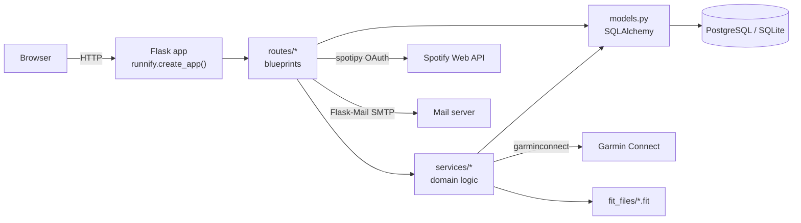
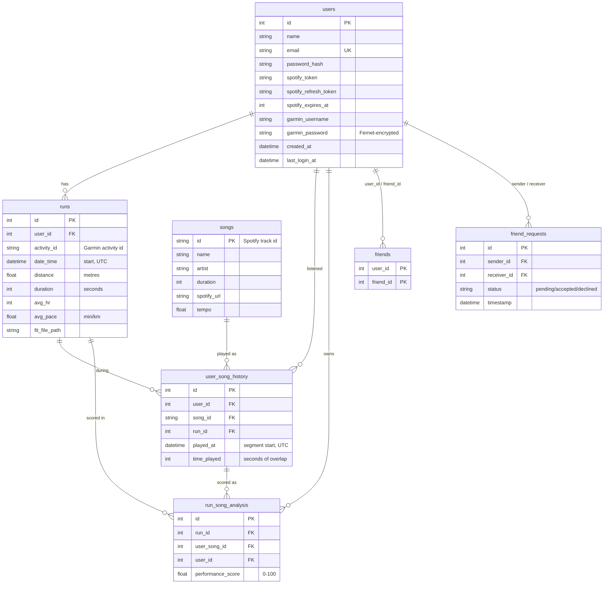

# Architecture

Runnify is a single, server-rendered Flask application. There is no separate
frontend build: pages are Jinja2 templates, and the charts use Chart.js loaded from a CDN.

## Components

| Layer | Location | Responsibility |
|---|---|---|
| App factory | `runnify/__init__.py` | `create_app()` builds the `Flask` app, loads `Config`, binds the extensions, registers blueprints and the 404 handler |
| Extensions | `runnify/extensions.py` | Unbound `db`, `migrate`, `mail` and `login_manager` instances shared by every module |
| Migrations | `migrations/` | Alembic revisions that create and evolve the schema (`flask db upgrade`) |
| Config | `runnify/config.py` | Reads environment variables (via `python-dotenv`) into the `Config` class |
| Models | `runnify/models.py` | SQLAlchemy models and the `friends` association table |
| Routes | `runnify/routes/` | One blueprint per feature; request handling and template rendering |
| Domain logic | `runnify/services/` | FIT parsing, Garmin sync, Spotify history import, song-segment lookup, scoring, password rules; no HTTP |
| Templates / static | `runnify/templates/`, `runnify/static/` | Jinja2 pages, CSS, and small JS files for charts, dark mode, upload and filters |

### Application factory

`runnify` is an importable package. `create_app()` builds a fresh application
per call, which keeps configuration explicit and lets tests create isolated
apps. Flask's CLI finds the factory automatically: `flask --app runnify run`.

## Data model

Notes:

- All timestamps are stored as **naive UTC** datetimes.
- Friendships are stored **in both directions** (two rows in `friends`) when a request is accepted.
- The schema is created and evolved by Alembic migrations in `migrations/`; constraint names follow a fixed naming convention so migrations can alter them reliably.

## Pipeline 1: Garmin sync

Triggered when a user submits the form at `/garmin` (`routes/garmin.py`).

1. A `Garmin(email, password)` client logs in to verify the credentials.
2. The password is encrypted with `Fernet(FERNET_KEY)` and saved on the user, along with the email.
3. A **background thread** (with its own app context) calls
   `services/garmin.fetch_and_store_garmin_activities`, which:
   - pages through the activity list 20 at a time;
   - skips activities already stored and anything whose type is not `running`;
   - stores start time, distance, duration, average HR and average pace as a `Run`;
   - downloads the original activity zip, extracts the `.fit` file into `fit_files/`, and records its path;
   - commits once per page.

The user is redirected to the dashboard straight away while the sync continues.

## Pipeline 2: Spotify history import

Triggered by uploading `my_spotify_data.zip` at `/spotify/history/upload`
(`routes/spotify.py` → `services/history_import.import_history_zip_overlapping_runs`).

1. All of the user's runs are loaded as `[start, start + duration)` intervals.
2. Every `.json` file in the zip is **streamed** with `ijson`, so very large histories don't need to fit in memory.
3. For each row:
   - podcasts and videos (`episode_*` fields) are skipped, as are rows without a `spotify:track:` URI;
   - the play interval is `[ts - ms_played, ts)`, because Spotify's `ts` is when playback **stopped**;
   - unknown tracks are inserted into `songs`;
   - the play is intersected with every run. Each overlap of at least
     `HISTORY_MIN_OVERLAP_SECONDS` becomes a `user_song_history` row, unless an
     identical one already exists.
4. Rows are committed in batches.
5. Scoring: each run's FIT file is parsed once, then every matched play is
   scored with `services/scoring.score_segment` and stored in `run_song_analysis`. See [scoring.md](scoring.md).

## Spotify OAuth

`/spotify/login` redirects to Spotify's consent page using the `SPOTIFY_*`
settings. `/spotify/callback` exchanges the code and stores the access token,
refresh token and expiry on the user. `get_spotify_client()` refreshes tokens
that are about to expire. Listening data for the analysis comes from the
uploaded history zip, not the live API.

## Authentication and security

- Passwords are hashed with Werkzeug (`generate_password_hash` / `check_password_hash`).
- Password strength rules: at least 8 characters, with a letter, a digit and a special character (`services/passwords.py`).
- Password reset uses an `itsdangerous.URLSafeTimedSerializer` token signed with
  `SECRET_KEY` (salt `password-reset`, valid for 1 hour), sent by Flask-Mail.
- Garmin passwords are stored encrypted with Fernet (`FERNET_KEY`), because the background sync needs them to log in.
- Uploads are capped by `MAX_CONTENT_LENGTH` (600 MB).
